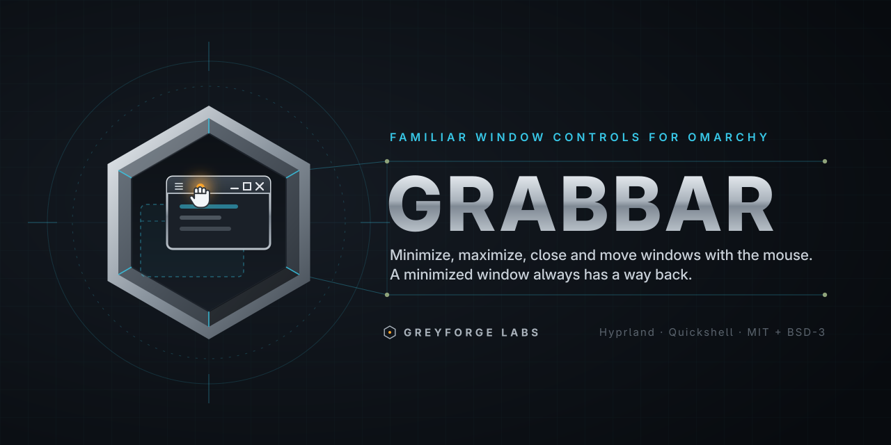
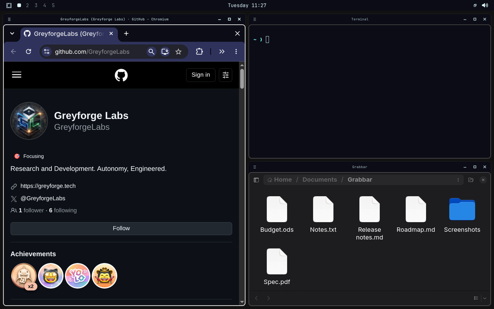
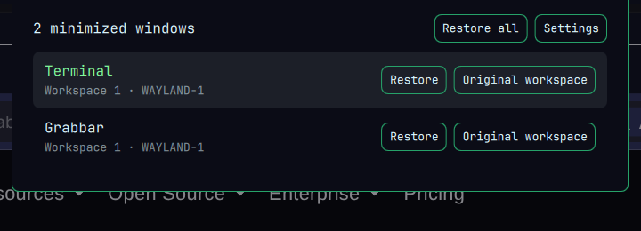
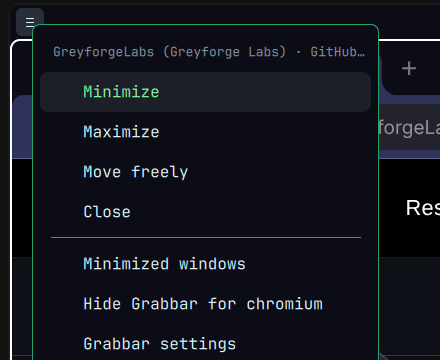
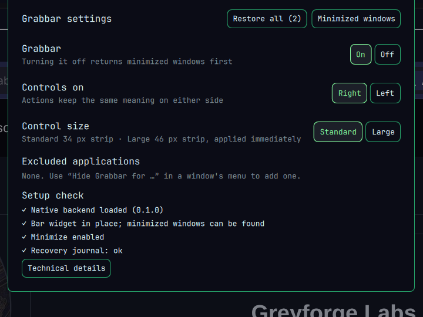

<p align="center">
  
</p>

<p align="center">
  <a href="https://github.com/GreyforgeLabs/omarchy-grabbar/actions/workflows/test.yml"></a>
  <a href="https://github.com/GreyforgeLabs/omarchy-grabbar/releases/latest"></a>
  <a href="LICENSE"></a>
  
  
</p>

<p align="center"><b>Minimize, maximize, close and move windows with the mouse. A minimized window always has a way back.</b></p>

Grabbar gives every ordinary application window on Omarchy a title strip with
the controls people expect from Windows and macOS: a window menu, **Minimize**,
**Maximize / Restore size** and **Close**. Drag the strip to move a window
(a tiled window pops out into floating mode and follows the pointer),
double-click it to maximize. Minimized windows go into a drawer that lives
in the bar, so they are never lost.

The strip is drawn by the compositor in space reserved for it. It never
covers tabs, address bars, toolbars or document content, and it follows your
Omarchy theme.

<p align="center">
  
</p>

## What you get

| | |
| --- | --- |
| **Title strip** | Menu button, ellipsized title, Minimize · Maximize/Restore · Close. Buttons act on release inside the same target — press Close, drag away, release: nothing happens. |
| **Move** | Drag the strip. A tiled window detaches into floating mode at a usable size with the pointer still on the strip; a maximized window gets its size back first. Uses the compositor's own drag, no polling. |
| **Resize** | Native edge/corner resize with `general:resize_on_border` (Omarchy's default is off; see [Configuration](#configuration)). |
| **Minimize** | Two-phase: the shell writes a recovery record *before* the window is hidden on Grabbar's own `special:grabbar-minimized` workspace. Nothing is paused, muted or killed. |
| **Drawer** | Bar widget with a window-stack icon and a count. Click it: every minimized window, newest first, with **Restore** and **Original workspace**, plus **Restore all**. Right-click the widget for Settings. |
| **Window menu** | Menu button or right-click on the strip: Minimize, Maximize/Restore size, Move freely (checked when floating), Close, Minimized windows, Hide Grabbar for this app, Settings. |
| **Settings** | Grabbar on/off, controls on the left or right, standard (34 px) or large (46 px) controls, excluded applications, a setup check. |
| **Recovery** | If the shell service disappears for longer than a short grace period, the native backend returns every hidden window by itself and switches the strips off. Unloading the native plugin returns them too. A journal under `~/.local/state/grabbar` reconciles against live compositor state on every start. |
| **Theme** | Strip colours and font come from the Omarchy theme through the shell; nothing to configure. |

<p align="center">
  
</p>
<p align="center">
  
  
</p>

## Alongside other tools

Grabbar keeps its hidden windows on its own workspace and never shows it.
When something else focuses a hidden window — a click in
[Hotbar](https://github.com/GreyforgeLabs/omarchy-hotbar), a window
switcher, `hyprctl dispatch focuswindow` — Grabbar restores that window
properly instead of letting the whole hidden set pop up.
[Reprieve](https://github.com/GreyforgeLabs/reprieve) keeps parking on its
own workspace; the two do not touch each other's windows. Details and the
tested matrix: `docs/COMPATIBILITY.md`.

## Status

**0.1.1 preview** (spec milestone G3). The whole workflow — strip, menu,
drawer, settings, journal, recovery — is implemented and qualified on one
exact desktop build: **Omarchy 4.0.x with Hyprland 0.56.2
(`efb50993…`)** and Quickshell 0.3.1. The native part is a compositor
plugin and only loads into the Hyprland build it was compiled against.
`docs/COMPATIBILITY.md` lists what was tested; `docs/QUALIFICATION.md`
holds the evidence. Anything not listed there is unqualified, not
"probably fine".

## Install

This is a preview release. Clean-install and full-login qualification of
the latest loader hardening remains pending. See [release safety](docs/RELEASE-SAFETY.md)
for verified results and the remaining stable-release gate.

Two parts: the shell plugin (drawer, menu, settings, journal) and the native
compositor plugin (the strip itself). Everything works without the native
part except that there is no strip yet.

### 1. Shell plugin

```sh
omarchy plugin add https://github.com/GreyforgeLabs/omarchy-grabbar.git --enable
```

The Grabbar widget appears in the bar's right section. It shows a window
stack icon; the tooltip says "Grabbar's native backend is not loaded" until
step 2 is done.

### 2. Native strip

The native plugin is a small extension derived from Hyprbars. Build it
against your installed Hyprland headers (the `hyprland` package ships them):

```sh
cd ~/.config/omarchy/plugins/tech.greyforge.grabbar
make -C native/grabbar CXX=g++          # needs g++, pkg-config, hyprland headers, cairo
```

Then load it once, live, without touching your config:

```sh
hyprctl plugin load "$PWD/native/grabbar/grabbar.so"
grabbar status
```

Strips appear on every window immediately. If the build does not match the
running Hyprland, the plugin refuses to load and says so; nothing is
decorated and nothing is hidden.

### 3. Load it at login (optional)

```sh
grabbar autoload enable      # adds ONE guarded line to ~/.config/hypr/hyprland.lua, with a backup
grabbar autoload status
```

`enable` never loads anything itself; the plugin loads at the next
`hyprctl reload` or login. The loader records each new compositor's startup
attempt before declaring the plugin. If that attempt has no matching health
marker on the next start, the loader skips the plugin until
`grabbar autoload retry`. Missing session identity or failure to save the
attempt also keeps native controls off. A health marker after 15 seconds
does not certify later runtime stability, and manual plugin loading bypasses
this guard. Read
[`docs/AUTOLOAD.md`](docs/AUTOLOAD.md) for why this line is shaped the way
it is — an earlier, conditional version of it broke a desktop.

`grabbar autoload disable` removes the line again (byte-exact, with a backup).

### Updating

```sh
omarchy plugin update tech.greyforge.grabbar
omarchy restart shell                              # the service is keepLoaded; a hot reload keeps the old one
make -C ~/.config/omarchy/plugins/tech.greyforge.grabbar/native/grabbar CXX=g++   # after a Hyprland or Grabbar update
```

Before rebuilding the native plugin, restore your minimized windows
(`grabbar restore-all`). The new `.so` is picked up at the next login (or
`hyprctl plugin unload` + `load`; unloading returns hidden windows first).

## Everyday use

- **Minimize** hides the window and adds it to the drawer. Click the bar
  widget (window-stack icon with a count) to get it back; **Original
  workspace** returns it where it came from; **Restore all** brings all of
  them to the current workspace. Middle-click the widget for Restore all.
- **Maximize** fills the work area while keeping the bar and the strip.
  Double-click the strip does the same. Maximizing from a keybind or
  another tool is reflected too.
- **Drag** the strip to move. Dragging a tiled window makes it floating
  ("Move freely" in the menu shows a check); clear it to return the window
  to the layout.
- **Close** sends the application's normal close request; unsaved-work
  prompts belong to the app. Grabbar never kills anything.
- **Window menu** (≡ or right-click on the strip): text versions of the
  controls, plus "Hide Grabbar for this app" (asks first, reversible in
  Settings).
- **Settings** (right-click the widget, or `grabbar settings`): on/off,
  left/right controls, standard/large size, excluded apps, setup check with
  technical details.

Turning Grabbar **off** returns minimized windows first, then removes the
strips and refuses new minimizes until it is turned on again.

## Command line

`bin/grabbar` lives in the plugin checkout
(`~/.config/omarchy/plugins/tech.greyforge.grabbar/bin/grabbar`). Symlink it
into `~/.local/bin` to have `grabbar` on your path.

| Command | Does |
| --- | --- |
| `grabbar` | Open the drawer (Settings when Grabbar is off) |
| `grabbar settings` / `setup` | Open Settings |
| `grabbar status [--json]` | Backend + shell health, minimized count |
| `grabbar windows` | Windows known to the backend with their tokens (no titles) |
| `grabbar restore TOKEN [--original]` | Restore one window |
| `grabbar restore-all` | Restore every window Grabbar owns — works even when the shell is gone |
| `grabbar doctor` | Read-only diagnostics: versions, socket, journal, hidden windows, conflicting decorators, autoload state |
| `grabbar autoload status\|enable\|disable\|retry` | The login hook |
| `grabbar disable` / `enable` | Same as the Settings switch |
| `grabbar uninstall` | Restore windows, turn off, remove the autoload hook, remove the shell plugin |

Exit codes: `0` ok · `2` usage · `3` backend unavailable · `4` stale target ·
`5` shell service not running · `7` incomplete recovery.

## Configuration

Settings that people change live in Settings (persisted in this plugin's
entry in `~/.config/omarchy/shell.json`, mirrored to
`~/.local/state/grabbar/settings.json`). The rest are Hyprland config
values, for `~/.config/hypr/hyprland.lua`:

```lua
hl.config({ plugin = { grabbar = {
  enabled = true,            -- strips on/off at the compositor level
  buttons_left = false,      -- overridden by Settings when the shell is connected
  bar_height = 34,           -- ditto (Settings: standard 34 / large 46)
  button_size = 32,
  padding = 4,
  text_size = 11,
  text_font = "Sans",        -- the shell pushes the bar font when connected
  bar_color = 0xff2a2f36,    -- colours are pushed from the Omarchy theme when connected
  inactive_bar_color = 0xff20242a,
  text_color = 0xffe6e9ee,
  hover_color = 0x40ffffff,
  close_hover_color = 0xd0c0392b,
  shell_grace_ms = 2000,     -- how long hidden windows wait for a shell reload before coming back
}}})
```

Per-window: the `grabbar:no_bar` window-rule effect hides the strip for a
rule's matches (the Settings exclusion list does the same by class without
editing config). For mouse resizing on edges and corners:

```lua
hl.config({ general = { resize_on_border = true, extend_border_grab_area = 6 } })
```

## How it is built

```
compositor (Hyprland)                          omarchy-shell (Quickshell)
┌────────────────────────────────┐   unix socket   ┌──────────────────────────────┐
│ native/grabbar/*.so            │◀───────────────▶│ Service.qml                  │
│  strip rendering + input       │  line protocol  │  journal writer, restore     │
│  window tokens, typed actions  │  (docs/PROTOCOL)│  model, settings, theme push │
│  owned hidden workspace        │                 │ BarWidget.qml  Panel.qml     │
│  grace timer + recovery        │                 │  widget         drawer/menu/ │
└────────────────────────────────┘                 │                 settings     │
          ▲ hyprctl grabbar                        └──────────────────────────────┘
          │                                             ▲ omarchy-shell IPC
     bin/grabbar  ─────  helpers/grabbar_backend.py ────┘   helpers/grabbar-journal
```

- Every action carries a **window token** issued by the backend; a token
  that no longer maps to the same live window answers `stale`, never "the
  focused window instead".
- The native side **starts suspended**: no strip and no reserved space until
  a shell service that can show the drawer completes the readiness
  handshake. No drawer, no Minimize.
- The shell is the **only journal writer**; the journal never contains
  titles. Reconciliation follows the table in the specification (§7.4):
  prepared-but-visible entries are cancelled, entries for visible windows
  are cleared without moving anything, unrecorded windows on Grabbar's
  workspace are shown as *Recovered*.
- No polling, no timers except the one-shot grace timer, no subprocesses
  per pointer event, no network.

More: [`docs/ARCHITECTURE.md`](docs/ARCHITECTURE.md),
[`docs/PROTOCOL.md`](docs/PROTOCOL.md), [`docs/UPSTREAM.md`](docs/UPSTREAM.md)
(what changed relative to Hyprbars).

## Testing

```sh
tests/run.sh                                  # offline: model, journal, autoload, protocol, syntax, manifest
```

Everything that touches a compositor runs in a **nested Hyprland on a
headless output**, never on the desktop you are sitting at. The rig, the
sandboxed `omarchy-shell` and the scripts are described in
[`docs/QUALIFICATION.md`](docs/QUALIFICATION.md):

| Script | Covers |
| --- | --- |
| `tests/integration/g0-nested.sh` | Strip geometry, F03 drag-away cancel, maximize, double-click, minimize/restore, stale tokens, tiled drag, shell loss (R02), unload (R03) |
| `tests/integration/g1-service-nested.sh` | The shell service against the backend: handshake, two-phase minimize, journal permissions, restore, service death, reconciliation |
| `tests/integration/apps-nested.sh` | Per-application matrix (browsers, terminals, GTK/Qt, XWayland, media) |
| `tests/integration/scenarios-nested.sh` | F02, F05, F08 (many windows), R05 (journal write failure), R09 (output removed), R10 (pinned), R15 (fullscreen) |
| `tests/integration/stress-nested.sh` | 500 minimize/restore cycles watching memory, fds and tracked entries |
| `tests/integration/startup-nested.sh` | Cold start, reloads, load/unload and the boot guard |

## Known limitations (0.1.1)

- Qualified on one Hyprland build only. A different build needs a rebuild
  and a rerun of the nested suites.
- Modal dialogs: a window with an open modal cannot be minimized ("This
  window cannot be minimized while its dialog is open"); the dialog itself
  cannot either. Minimizing a whole modal family is not implemented.
- Touch input is not handled by the strip.
- Native tooltips on the strip are not drawn; the window menu carries the
  text of every action.
- A floating window placed under the bar keeps its own position; only
  restores and detaching drags clamp into the work area.
- The recovery handle for bars that cannot host the widget is not built;
  without the bar widget Minimize stays disabled (by design).

## License

Greyforge code is MIT. The native backend is derived from
[Hyprbars](https://github.com/hyprwm/hyprland-plugins) (BSD-3-Clause,
Hypr Development); see `THIRD_PARTY_NOTICES` and `docs/UPSTREAM.md`.
